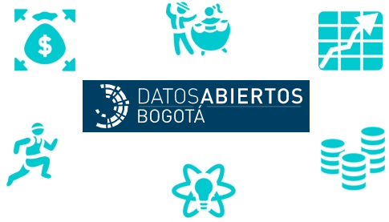

# Bienvenidos a la plataforma de datos abiertos Bogotá

[Datos abiertos Bogotá](http://datosabiertos.bogota.gov.co/) busca promover entre las entidades del Distrito Capital la transparencia, el acceso a la información pública, la competitividad, el desarrollo económico, y la generación de impacto social a través de la apertura, la reutilización de los datos públicos, y el uso y apropiación de las TIC de acuerdo a la estrategia de Gobierno digital de Colombia.

