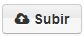
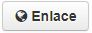
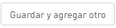

# Adiciona un recurso

**1. Agrega tus recursos:** La plataforma te ubica en la pestaña **"Recurso",** para que agregues todos los recursos que necesites para tu conjunto de datos.

**2. Selecciona la fuente de tu recurso:** Vincula un archivo desde tu computador usando el botón  o incluye una "URL" usando el botón  


_**Actualmente la plataforma de datos te permite cargar archivos de hasta 3 Gb.**_


**3.Completa el recurso:** Luego de seleccionar la URL o el archivo, deberás asignarle un nombre, una descripción \(_si es necesario_\) y el formato correspondiente al recurso que vas a publicar.



**1.Ponle nombre a tu recurso:** Digita en la caja de texto **"Nombre",** el nombre completo de la sigla que identifica el tipo de formato o de servicio al que pertenece el recurso, luego la sigla del formato en paréntesis. Estos son algunos ejemplos:

* Keyhole Markup Zip \(KMZ\)
* Web Map Service \(WMS\)
* Shape File \(SHP\)


El listado de nombres y el orden de los recursos los puedes encontrar en la sección [_**"Orden de los recursos"**_](https://datosbogota.gitbook.io/manual-usuario/agregar-un-conjunto-de-datos-o-dataset/orden-de-los-recursos)


**2.Describe tu recurso:** Este campo solo se diligencia si el recurso es un _**servicio**_. Se usa para identificar el tipo de servicio que se esta incluyendo.

**3.Formato:** Digita el formato del archivo que subirás.


_Los nombres de los formatos deben ir en mayúsculas, NO deben ponerse puntos o comas._ _**Ejemplo: CVS - XML -  RDF - ZIP**_



_**Tenga en cuenta:**_ Cuando cargue un archivo GeoJSON el nombre del formato debe escribirse en una sola palabra sin espacio. **"GEOJSON"**


**4. Agregar otro recurso:** Da clic en el botón **** **** 



**1.Ponle nombre a tu recurso:** Digita en la caja de texto **"Nombre",** una etiqueta que permita identificar el tipo de formato o tipo de servicio al que pertenece el recurso.

Ejemplos:

* Servicio REST
* Web Map Service \(WMS\)
* Web Feature Service \(WFS\)


El listado de nombres y el orden de los recursos los puedes encontrar en la sección [_**"Orden de los recursos"**_](https://datosbogota.gitbook.io/manual-usuario/agregar-un-conjunto-de-datos-o-dataset/orden-de-los-recursos)


**2.Describe tu recurso:** Digita en la caja de texto el tipo de servicio que estás creando.


_**Tenga en cuenta:** Debe colocar en este campo el tipo de servicio**. Ej: Visualización, Visualización y descarga, descarga .** Esto dependerá si el servicio es WMS, WFS o Esri REST._


**3.Formato:** Digita el formato WMS o tipo de servicio del recurso que subirás.


_Los nombres de los formatos deben ir en mayúsculas, NO deben ponerse puntos o comas._ _**Ejemplo: WMS - WFS - ESRI REST - HTML**_


**4. Agregar otro recurso:** Da clic en el botón  ****  



**3. Guardar:** Da clic en el botón _**"Finalizar"**_ para guardar el dato y publicar. Si deseas subir otro recurso da clic en el botón _**"Guardar y agregar otro"**_

**4.Configura una vista:** Sigue los pasos que te indica ["**Configura vistas al recurso"**](https://datosbogota.gitbook.io/manual-usuario/configura-las-vistas)\*\*\*\*

