# Conoce el dato

**1.Reconoce el dato:** Después de realizar la búsqueda, aparecerá el listado de los datos  que fueron encontrados, puedes ver su nombre, última fecha de modificación, la entidad que lo dispone, la descripción del mismo, también el número de descargas y de visitas que se han realizado a este y los diferentes formatos en que está dispuesto.

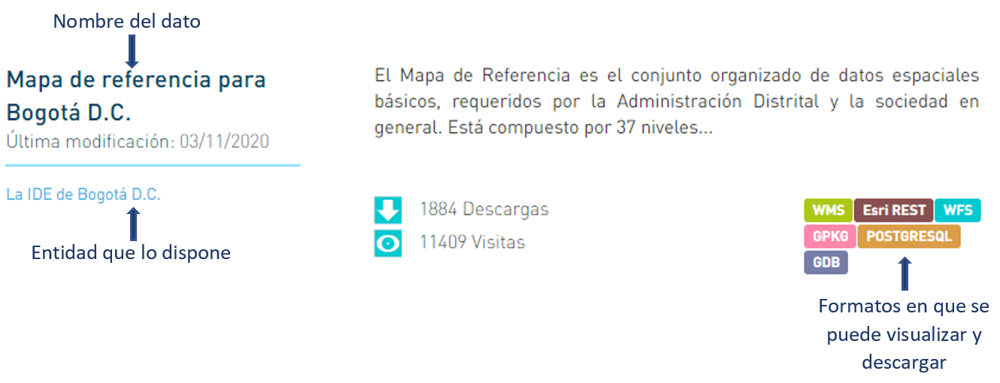

**2.Selecciona un dato:** Da clic sobre el nombre del dato de tu interes para acceder a el**.**

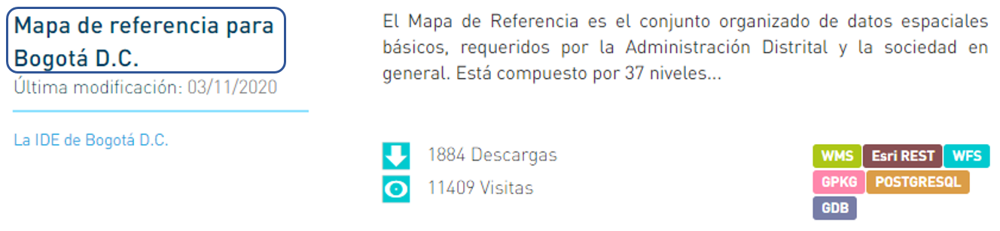

 **3.Infórmate:** Conoce sobre el dato que estás consultado leyendo su descripción, descubre su licencia, última fecha de actualización, número de descargas y visitas, sus recursos para visualización y descarga y la información adicional disponible.

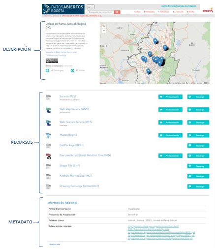


_**Tenga en cuenta:**_ El conteo de descargas y visitas de actualizará cada hora


**4.Visualiza y descarga recursos:** Los recursos son dispuestos en diferentes formatos de visualización y descarga en formatos abiertos, que no requieren programas licenciados para su manipulación. 

**4.1.Previsualiza el recurso:** Da clic sobre el botón **"Previsualización"** del recurso de tu preferencia.

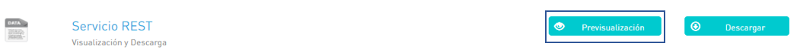

El recurso se mostrara en el mapa de la ciudad si es geográfico.

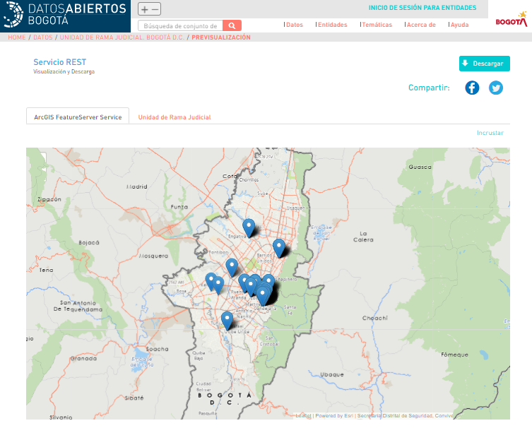


Puedes compartir el dato en las redes sociales twitter y Facebook, dando clic sobre cualquiera de sus iconos.                                               


Para los datos alfanuméricos en la pantalla de previsualización se puede observar la tabla con los datos.

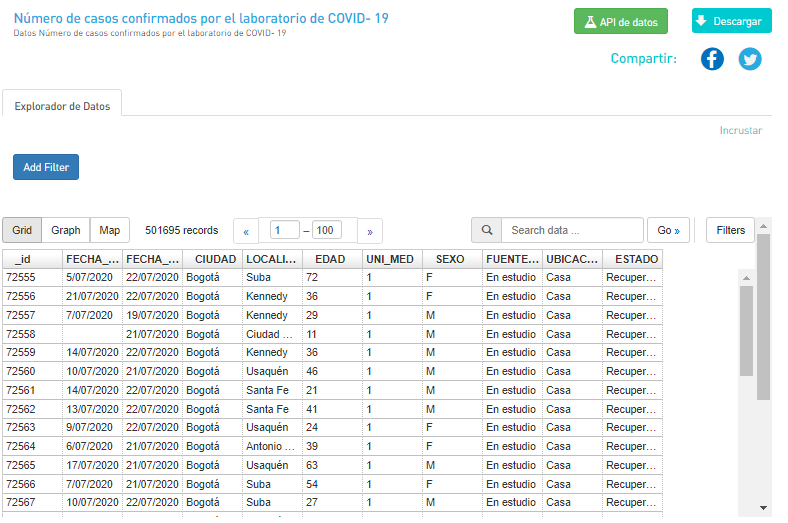


Solo se pueden visualizar hasta 65000 elementos, si el dato contiene mas debes realizar la descarga y buscar un software para su visualización.


Además de pueden realizar filtros y búsquedas sobre los mismos.

Agrega filtros con el botón 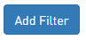luego selecciona el atributo que deseas.  

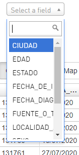

y los valores que te interesan

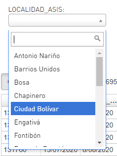

Inmediatamente se actualizara la tabla con el filtro seleccionado.


Se pueden realizar los filtros que necesites, solo debes adicionarlos a los ya existentes. 


También se pueden hacer búsquedas sobre la tabla ingresando la palabra que se busca:

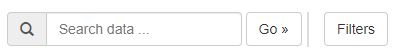

**4.2.Descarga el recurso:** Da clic sobre el botón **"Descargar"** del recurso de tu preferencia y este guardara en la carpeta de descargas de tu equipo. ​

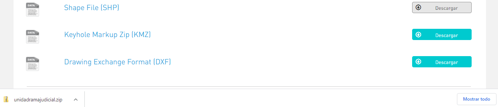


También puedes realizar la descarga desde la vista de previsualización en la parte superior derecha.


**5. Ver información adicional:** En la parte final encuentras la información adicional del dato, que corresponde al metadato del mismo. Para visualizarla complatamente da clic en  

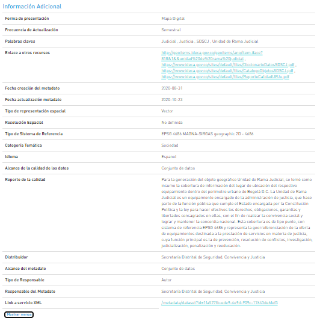

Encontraras la forma de presentación del dato, su frecuencia de actualización, palabras claves del dato, enlaces a otros recursos \(Documentación asociada como el ítem geográfico, el diccionario de datos, el catalogo de objetos, el reporte detallado de calidad del dato, entre otros\),  la fecha de creación y actualización de metadato, la categoría temática, el idioma, el reporte de calidad, el distribuidos, el tipo de responsable y un link para hacer la descarga del metadato en XML. 

Si el dato es geográfico encontraras el tipo de representación espacial, su resolución espacial y su sistema de referencia.

