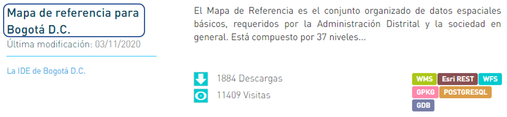

# Conoce el dato

**1.Reconoce el dato:** Después de realizar la búsqueda, aparecerá el listado de los datos  que fueron encontrados, puedes ver su nombre, última fecha de modificación, la entidad que lo dispone, la descripción del mismo, también el número de descargas y de visitas que se han realizado a este y los diferentes formatos en que está dispuesto.

**2.Selecciona un dato:** Da clic sobre el nombre del dato de tu interes para acceder a el**.**

 **3.Infórmate:** Conoce sobre el dato que estás consultado leyendo su descripción, descubre su licencia, última fecha de actualización, sus recursos de visualización y descarga y la información adicional disponible.

