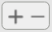
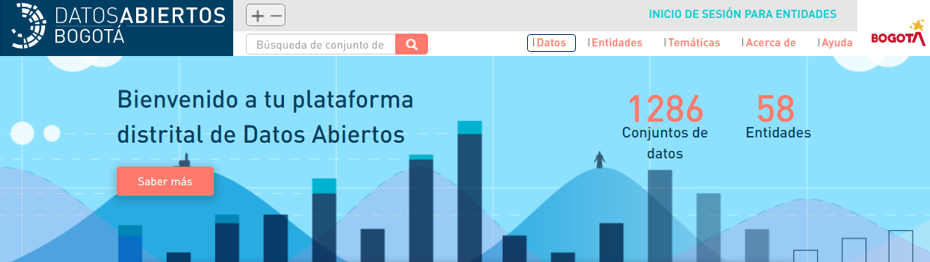
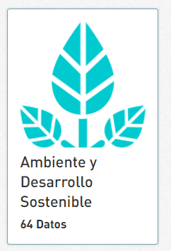
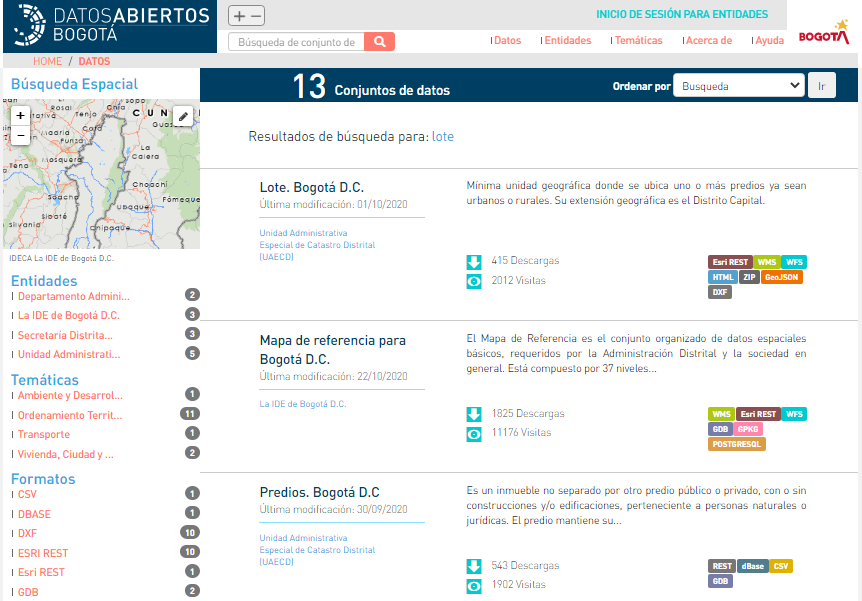
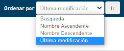

# Consulta los datos

 **1.Identifica las formas de acceso a los datos:** Puedes acceder a un dato desde las opciones: barra de búsqueda, Datos, Entidades o en una de las 27 temáticas disponibles.


Con el botón puedes ajustar el tamaño de la fuente de los textos, para brindar una mejor accesibilidad a personas con visión reducida.


**2.Ubica un dato:** Puedes acceder a los  datos de las siguientes formas:



**1.Busca el dato:** En cualquiera de las barras de búsqueda escribe la o las palabras que describan el dato que estás buscando. Da clic sobre la lupa para encontrar los resultados.



**1.Ingresa a datos:** Da clic sobre el botón **"Datos".**




**1.Ingresa a entidades:** Da clic sobre el botón **"Entidades".**

 **2.Reconoce las entidades:** Aparecerá un listado con las entidades que han publicado sus datos en la plataforma.

**3.Ordena tu búsqueda:** En la parte superior derecha cuentas con la opción de  ordenar las entidades:

Aparecerá una lista desplegable en la que tienes la opción de organizar  por Nombre ascendente \(ordena de la A a la Z\) o por Nombre descendente \( ordena de la Z a la A\).

 **4.Selecciona una entidad:** Da clic sobre la entidad que deseas conocer.

**5.Conoce la entidad:** Encontraras una breve descripción de la entidad que escogiste y los datos que esta ha cargado.


Puedes compartir el dato en las redes sociales twitter y Facebook, dando clic sobre cualquiera de sus iconos.                                              




**1.Selecciona una temática:** Se puede hacer de dos formas: 

* Desde la página principal puedes dar clic en el listado de la temática de tu interés.

* Dando clic sobre el botón **"Temáticas".**

**2.Reconoce las Temáticas:** Aparecerá un listado con las temáticas disponibles en la plataforma, que facilitan la búsqueda de los de datos publicados.

**3.Ordena tu búsqueda:** En la parte superior derecha cuentas con la opción de  ordenar las temáticas:

Aparecerá una lista desplegable en la que tienes la opción de organizar  por Nombre ascendente \(ordena de la A a la Z\) o por Nombre descendente \(ordena de la Z a la A\).

**4.Selecciona una temática:** Da clic sobre la temática que deseas conocer.

**5.Conoce la temática:** Encontraras los datos asociados a la temática que escogiste.




**3.Reconoce los datos:** Aparecerá un listado con los datos que concuerdan con la búsqueda que realizaste.


En la parte superior encuentras la cantidad de datos que arroja la búsqueda.


**4.Ordena tu búsqueda:** En la parte superior derecha cuentas con la opción de  ordenar los datos:

Aparecerá una lista desplegable en la que tienes la opción de organizar por búsqueda \(aparecerán solamente cuando utilices la barra de búsqueda\), Nombre ascendente \(ordena de la A a la Z\), Nombre descendente \(ordena de la Z a la A\) y Ultima modificación \(prioriza el que halla sido modificado recientemente\).

**5. filtros de búsqueda**: Al lado izquierdo de la pantalla puedes colocar filtros sobre la búsqueda realizada.

Dichos filtros se pueden realizar por las entidades productoras de los datos, las temáticas asociadas, los diferentes formatos en los que están dispuestos los datos asociados a la búsqueda, sus licencias de uso y las diferentes palabras claves que se relacionan con ellos.

Solo debes dar clic sobre el o los filtros que requieres y aparecerán los datos que concuerdan con estos.

 **5. Conoce los últimos datos actualizados:** En la parte inferior de la página principal, encuentras los últimos cuatro datos que se han creado o actualizado en la plataforma.

