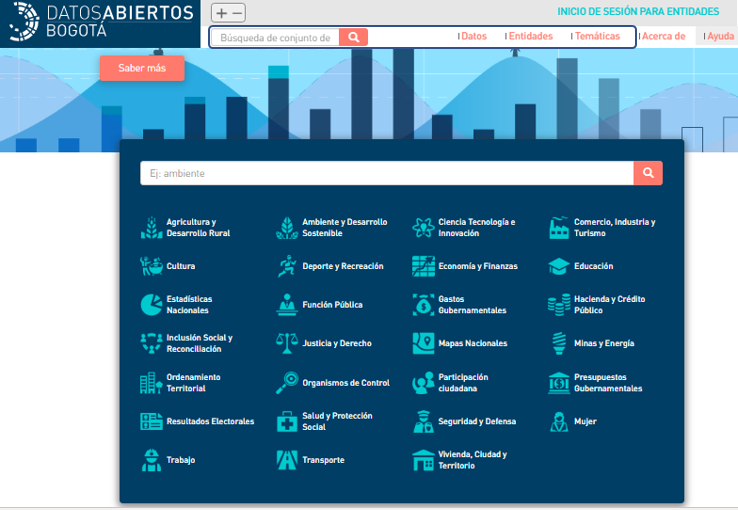
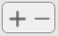
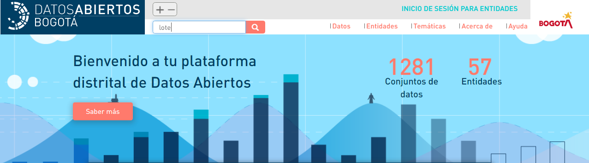
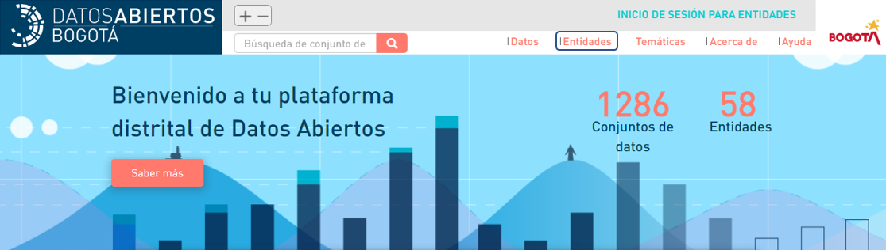
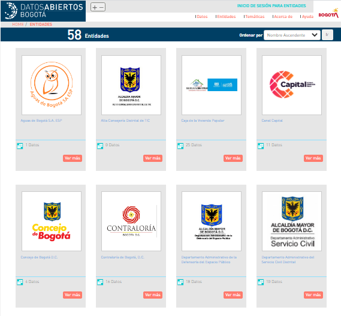
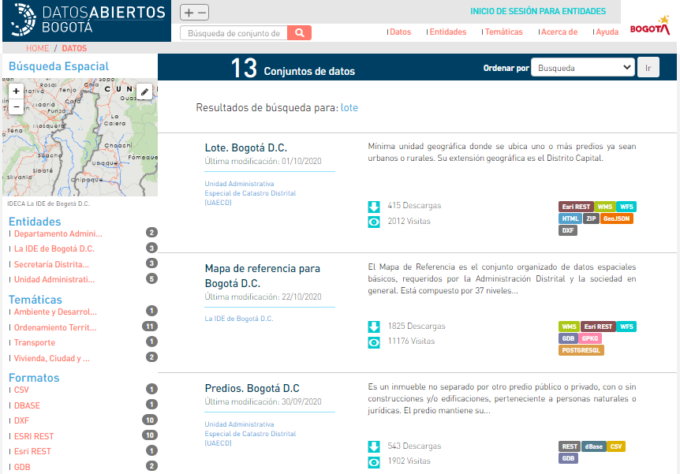
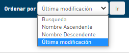

# Interactúa con los datos

 **1.Identifica las formas de acceso a los datos:** Puedes acceder a un dato desde las opciones: barra de búsqueda, Datos, Entidades o en una de las 27 temáticas disponibles.


Con el botón puedes ajustar el tamaño de la fuente de los textos, para brindar una mejor accesibilidad a personas con visión reducida.


**2.Ubica un dato:** Puedes acceder a los los datos de las siguientes formas:



**1.Busca el dato:** En la barra de búsqueda escribe la o las palabras que describan el dato que estas buscando. Da clic sobre la lupa para encontrar los resultados.




**1.Ingresa a datos:** Da clic sobre el botón **"Datos".**




**1.Ingresa a  entidades:** Da clic sobre el botón **"Entidades".**

 **2.Selecciona una entidad:** Da clic sobre la entidad de la cual deseas obtener los datos.




**1.Selecciona un temática:** Se puede hacer de tres formas, la primera en la pagina principal dando clic en el listado de temáticas de tu interés.

\*\*\*\*



**1.Ingresa a  entidades:** Da clic sobre el botón **"Entidades".**

 **2.Selecciona una entidad:** Da clic sobre la entidad de la cual deseas obtener los datos.




**2.Reconoce los datos:** Aparecerá un listado con los datos que concuerdan con la palabra que escribiste, bien sea en el nombre o en las palabras clave que del dato. 


En la parte superior encuentras la cantidad de datos que arrojo la búsqueda 


**3.Ordena tu búsqueda:** En la parte superior derecha cuentas con la opción de  ordenar los datos:

aparece una lista desplegable en la que tienes la opción de organizar por búsqueda \(aparecerán igual como realizaste la búsqueda la primera vez\), Nombre ascendente \(ordena de la A a la Z\), Nombre descendente \( ordena de la Z a la A\) y Ultima modificación \(prioriza el que halla sido modificado recientemente\)

**4.Selecciona un dato:** Da clic sobre uno de los conjuntos de datos**.**

 **5.Infórmate:** Conoce sobre el dato que estás consultado leyendo su descripción, descubre su licencia, última fecha de actualización, información adicional en su metadato y los recursos que tiene disponible.

