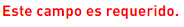
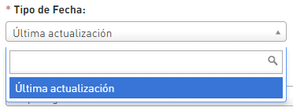
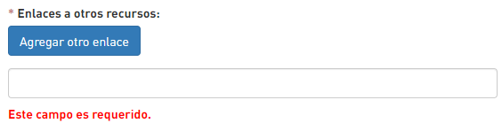
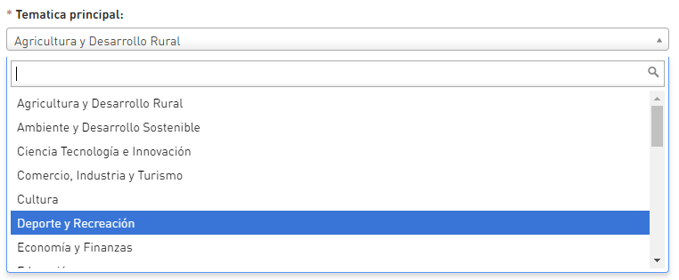
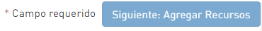

# Construye el metadato

**1.Ponle un nombre a tu dato:** Etiqueta tu conjunto de datos con una frase descriptiva que permita identificar la información que se está presentando.


**Ten en cuenta:** 

-Debe ser una frase corta que indica claramente el contenido que se encontrará en el dato. 

- Incluye las reglas de ortografía.

- Utiliza ****la siguiente estructura:

                                                _Nombre y extensión que cubre                                     ****_

                                     _**Ej:**_  **Modelo digital de terreno para Bogotá D.C.**

                                           **Predios propiedad horizontal. Bogotá D.C**



Cuando encuentres un asterisco  o las palabras  en un campo, debes llenarlo de forma obligatoria, si queda uno de estos campos sin información el sistema no permitira gestionar los recursos.


**2.Construye la URL:** El sistema genera automáticamente la url cuando creas el titulo. Sin embargo, tienes la opción de editarla dando clic en el botón "Edit".


_**Recuerda:** el nombre que pongas a la url debe ser un texto corto que identifique el dato._


**3.Describe tu conjunto de datos:** Digita una corta descripción acerca de los datos que se están incluyendo en la plataforma, puedes incluir el alcance, campo de aplicación y demás información que oriente al usuario sobre el tipo de información que podrá obtener al explorar este dato.

**4.Selecciona tu entidad:** Da clic sobre la lista desplegable **"Entidad"** y selecciona tú Entidad.


Solo aparecerán en la lista las entidades en las que esta inscrito el usuario que realiza la edición de los datos.


**5.Elige la visibilidad del dato:** Da clic sobre la lista desplegable "Visibilidad" y selecciona entre "**público"** o "**privado"**. 


Selecciona **"Público**" ****cuándo estés seguro de realizar la publicación de tu dato, de lo contrario deja selecciona el campo **"Privado"** y solo lo podrán ver los usuarios de la entidad que tengan una sesión en la página.


**6. Tipo de fecha:** Da clic en "Última actualización".

    **Fecha:** Digita la fecha teniendo en cuenta el formato ****AAAA-MM-DD

**7. Forma de presentación:** Da clic en la lista desplegable y selecciona una opción entre audio, audio digital, diagrama, diagrama digital, documento digital, documento impreso, imagen digital, imagen impresa, mapa digital mapa impreso, modelo digital, modelo impreso, objeto físico, perfil digital, perfil impreso, Tabla digital, tabla impresa, video y video digital**.**


Para el caso de imagen digital, imagen impresa, mapa digital y mapa impreso se habilitaran los siguientes campos:

* **Para el caso de  Tipo de representación espacial:** Selecciona cuál fue el método utilizado para representar espacialmente el recurso \(raster o vector\).                           
* **Resolución espacial:** Digita en la caja de texto la escala, resolución o nivel de detalle de los datos del recurso.
* **Tipo de Sistema de Referencia:** Da clic sobre la lista desplegable y da clic sobre el ****sistema de referencia utilizado.


**8. Categoría Temática:** Da clic en la lista desplegable y selecciona el tema principal con el que se asocia el recurso.

**9. Cobertura espacial:** Pega en este campo la cobertura espacial del dato. Este debe ser un JSON de 5 puntos.


**Se sugieren esta cobertura:** _{"type":"Polygon","coordinates":\[\[\[-74.267032,4.514065\],\[-74.267032,4.828575\],\[-73.969597,4.828575\],\[-73.969597,4.514065\],\[-74.267032,4.514065\]\]\]}_


**10.Frecuencia de actualización:** Da clic en la lista desplegable y selecciona el periodo en los cuales realizas la actualización del recurso.

**11.Usa etiquetas:**  Destaca aspectos del contenido no proporcionados por el título. Digita una palabra en el campo de texto "Etiquetas" y digita la tecla "coma" para agregar otra etiqueta.

**12.Selecciona una licencia:** Da clic sobre la lista desplegable **"Licencia"** y luego da clic en el tipo de licencia que le darás al dato que vas a publicar.

**13.Idioma:** Da clic en la lista desplegable y selecciona el idioma en los cuales se encuentran los textos que aparecen en el recurso.

**14. Enlace a otros recursos:** Pegua la URL de los recursos adicionales que puedan complementar la información suministrada, como por ejemplo paginas en donde se puede ver ahondar en el tema y/o documentos que lo explican, por ejemplo el diccionario de datos, catalogo de objetos, reporte de calidad detallado o el ítem geográfico.  

Se puede agregar la cantidad de enlaces que sean necesarios.

**15.Alcance de la calidad de los datos:** Da clic en la lista desplegable y selecciona el nivel de información sobre el cual se realiza calidad al dato. 

**16.Reporte de la calidad:** Digita en la caja texto una breve descripción de los elementos de calidad que evaluaste en el recurso, y el significado del resultado obtenido.

**17.Distribuidor:** Da clic en la lista desplegable y selecciona la entidad responsable de distribuir el recurso.

**18.Temática principal:** Da clic en la lista desplegable y selecciona la temática principal con el que se asocia el recurso.

**18.Alcance del metadato:** Da clic en la lista desplegable y selecciona el nivel de información sobre el cual se realiza calidad al metadato. 

**19.Tipo de responsable del metadato:** Da clic en la lista desplegable y selecciona qué función tiene el responsable sobre el metadato.

**20.Responsable del Metadato:** Da clic sobre la lista desplegable y selecciona ****quién fue su autor o quien será su custodio.

**21.Agrega los recursos:** Da clic en el botón para agregar los recursos que vas a disponer en datos abiertos.  

