# Estadísticas

**1.Inicia sesión:** Sigue los pasos de iniciar sesión.

**2. Ingresa al módulo de Estadísticas:** Da clic sobre el botón estadísticas que se encuentra ubicado en la parte superior izquierda de la pantalla.

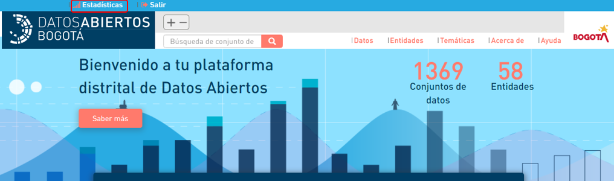

**3. Identifica la estadística**: Al lado izquierdo de la pantalla puedes escoger la estadística que necesitas.

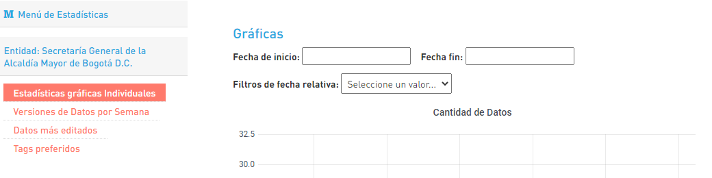



**1.  Ingresa a las estadísticas gráficas Individuales:** Da clic en 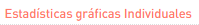 puedes ver las estadísticas individuales por cantidad de datos, recursos por conjunto de datos y cantidad de recurso.

**2. Revisa el rango de tiempo:** Para el administrador se pueden escoger periodos de tiempo específicos para realizar la estadística, puede ser por horas, días, meses o años.   

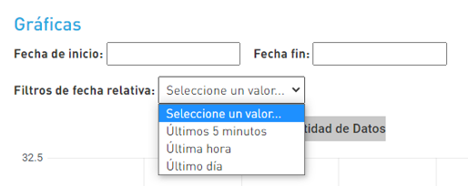

 **4. Conoce las estadísticas:** En cantidad de datos se muestra el número de conjuntos de datos que tiene cargada la entidad en el periodo de tiempo establecido. 

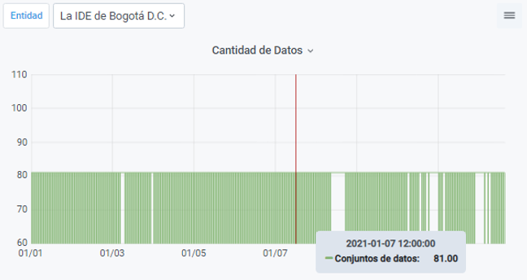

El grafico de recursos por conjunto de datos muestra en cada línea un conjunto de datos y su ubicación depende de los recursos que tiene asociados.

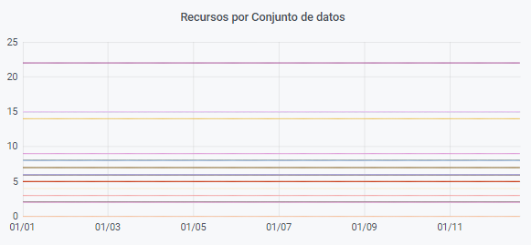

El grafico de cantidad de recursos muestra la totalidad de recursos que tiene la entidad.

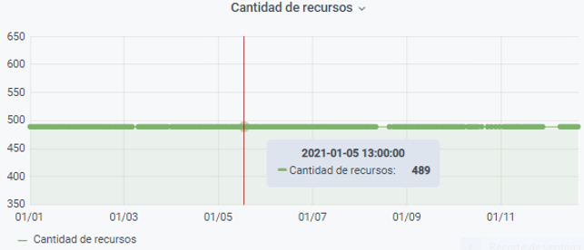



**1.  Ingresa a Versiones de Datos por Semana:** Da clic en 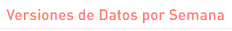 puedes ver cuantas versiones de datos o datos nuevos se han dispuesto en la plataforma semana a semana desde que tu entidad incluyo su primer dato.

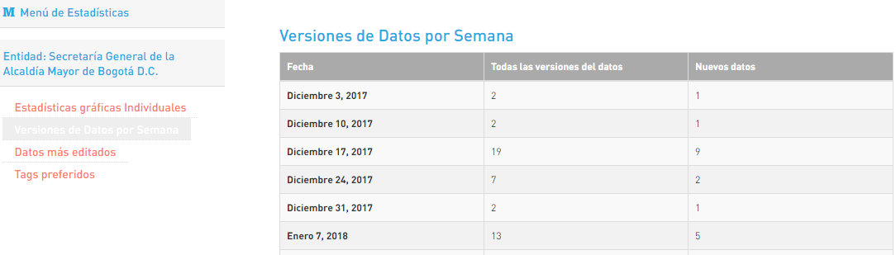



**1.  Ingresa a las datos más editados:** Da clic en 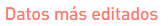puedes ver los datos con su número de ediciones en orden descendente. 

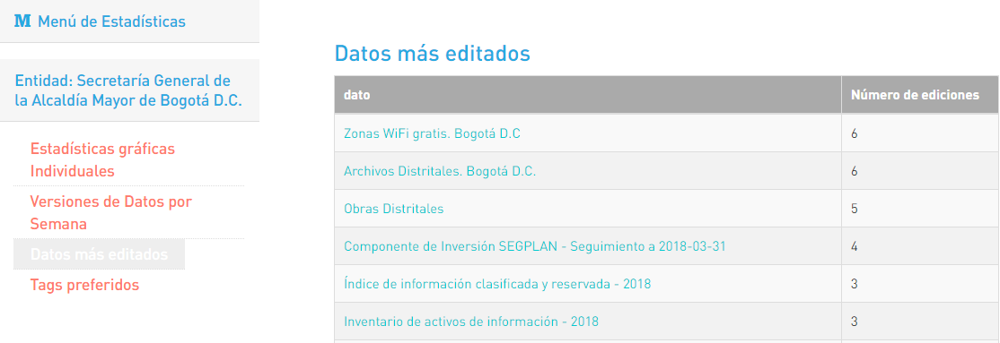



**1.  Ingresa a las Tags preferidos:** Da clic en 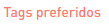puedes ver las etiquetas mas utilizadas para realizar la busqueda de tus datos y el número de datos asociados a ellas.

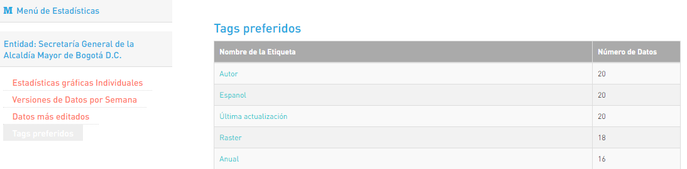



