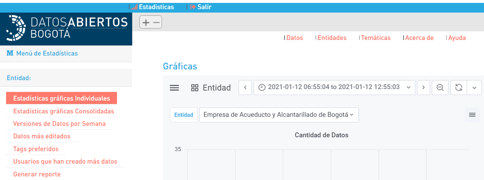
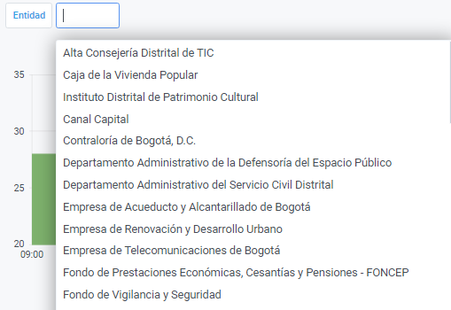
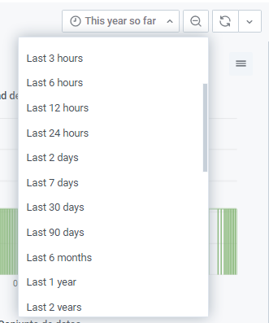
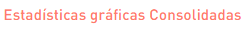
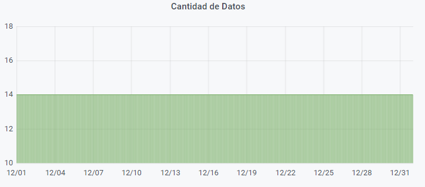
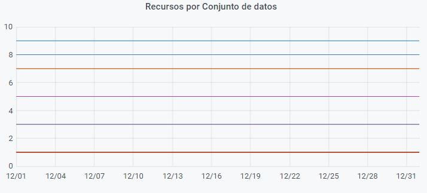
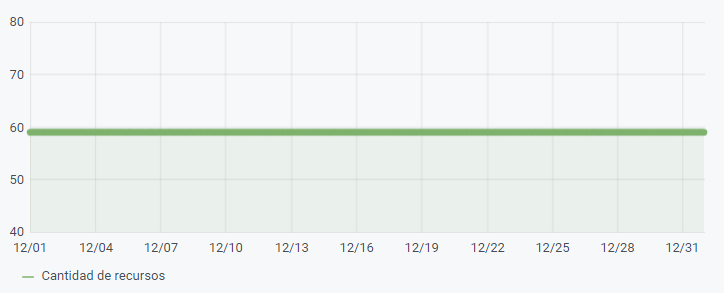

# Estadisticas

**1.Inicia sesión:** Sigue los pasos de iniciar sesión.

**2. Ingresa al módulo de Estadísticas:** Da clic sobre el boton estadisticas que se encuentra ubicado en la parte superior izquierda de la pantalla.


Depende del rol en el que te encuentres administrador o editor \(Entidades\) se presentaran diferentes estadísticas.


**3. Identifica la estadistica**: Al lado izquierdo de la pantalla puedes escoger la estadistica que necesitas.



**1.  Ingresa a las estadísticas gráficas Individuales:** Da clic en  puedes ver las estadísticas individuales por cantidad de datos, recursos por conjunto de datos y cantidad de recurso.

**2. Escoge la entidad de tu interés:** Si eres administrador puedes escoger cualquier entidad que tenga datos en la plataforma. 

Si perteneces a una entidad solo se verán tus datos.

**3. Revisa el rango de tiempo:** Para el administrador se pueden escoger periodos de tiempo específicos para realizar la estadística, puede ser por horas, días, meses o años.   

Si perteneces a una entidad se vera así:

 **4. Conoce las estadísticas:** En cantidad de datos se muestra el número de conjuntos de datos que tiene cargada la entidad en el periodo de tiempo establecido. 

El grafico de recursos por conjunto de datos muestra en cada línea un conjunto de datos y su ubicación depende de los recursos que tiene asociados.

El grafico de cantidad de recursos muestra la totalidad de recursos que tiene la entidad.





**Esta Grafica solo funciona para el administrador**


**1.  Ingresa a las estadísticas gráficas Consolidadas:** Da clic en puedes ver las estadísticas consolidadas con el total de datos y de recursos.

**2. Escoge la entidad de tu interés:** Si eres administrador puedes escoger cualquier entidad que tenga datos en la plataforma.

**3. Revisa el rango de tiempo:** Se pueden escoger periodos de tiempo específicos para realizar la estadística, puede ser por horas, días, meses o años.   

 **4. Conoce las estadísticas:** En cantidad de datos se muestra el total de conjuntos de datos que tiene cargada la entidad en el periodo de tiempo establecido. 

El grafico de recursos por conjunto de datos muestra en cada línea un conjunto de datos y su ubicación depende de la totalidad recursos que tiene asociados.

El grafico de cantidad de recursos muestra la totalidad de recursos que tiene la entidad.




