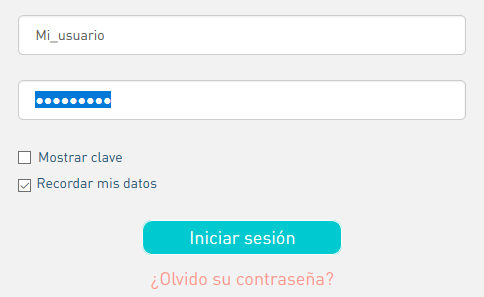
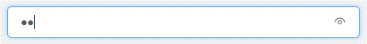

# Iniciar sesión

**1.Selecciona "Iniciar sesión":** Da clic en el botón **"Iniciar sesión para entidades"**, ubicado en la parte superior derecha de la pantalla.

**2. Ingresa:** Digita tu usuario y contraseña, enseguida da clic en el botón **"Iniciar sesión".**


Al dar clic en **"Recordar mis datos"** dejas automáticamente guardado en tú navegador el usuario y contraseña.



Para ver la clave que estas digitando, habilita "**Mostrar clave**" o en la barra en que escribes la contraseña da clic sobre el icono del ojo.  



_**El usuario y contraseña serán enviados a tu correo desde la cuenta ideca@catastrobogota.gov.co. La contraseña debe ser cambiada con el primer ingreso a la plataforma de datos abiertos Bogotá, sigue los pasos en**_ [_**"cambia tú contraseña"**_](https://datosbogota.gitbook.io/manual-usuario/inicia-sesion/cambia-tu-contrasena)_\*\*\*\*_


\*\*\*\*

