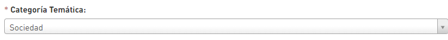

# Vincula una temática

**1.Inicia sesión:** Sigue los pasos de [**"Inicia sesión"**](https://datosbogota.gitbook.io/manual-usuario/inicia-sesion)\*\*\*\*

**2. Crea el dato:** Cuando construyas el metadato, siguiendo los pasos de ["Construye un metadato"](https://app.gitbook.com/@datosbogota/s/manual-usuario/~/drafts/-MQZLRbIiqFk38jeijuU/gestiona-tus-datos/agregar-un-conjunto-de-datos-o-dataset/construye-el-metadato) debes asignar obligatoriamente una temática.

**3. Asigna otra temática:** Da clic sobre la pestaña "**Mis conjuntos de datos**" y luego da clic sobre el dato al cual vas a vincularle una temática.

**4. Ingresa a temáticas:** Da clic sobre el botón "Temáticas".

**5. Vincula otra temática:** Da clic sobre la lista desplegable y luego da clic sobre la temática relacionada con el dato publicado.


**Tenga en cuenta:** Al realizar la vinculación el dato se podrá buscar desde la funcionalidad temáticas, permitiendo al usuario asociar el dato con una categoría especifica.



Puedes compartir el dato en las redes sociales Twitter y Facebook, dando clic sobre cualquiera de sus iconos.                                              


