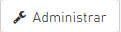

# Cambia tú contraseña

**1.Inicia sesión:** Sigue los pasos de "[Inicia sesión](https://datosbogota.gitbook.io/manual-usuario/inicia-sesion)".

**2. Ingresa a configuraciones:** Da clic sobre tu nombre de usuario, ubicado en la parte superior izquieda de la página.

**3. Ingresa por administrar:** Da clic en el botón Administrar ubicado en el panel inferior.

**4.Cambia tu contraseña:** En la parte inferior encontrarás la sección "cambia tu contraseña". Digita la contraseña anterior, luego la nueva contraseña y vuelve a confirmar la nueva contraseña. Por último da clic en  


_**Tenga en cuenta:** La contraseña debe tener números, caracteres especiales, letras mayúsculas y minúsculas. Se sugiere que la longitud sea de 10 caracteres._


**4.Actualiza tu perfil:** Para que los cambios que realices se hagan efectivos, debes dar clic en el botón "Actualizar perfil".

